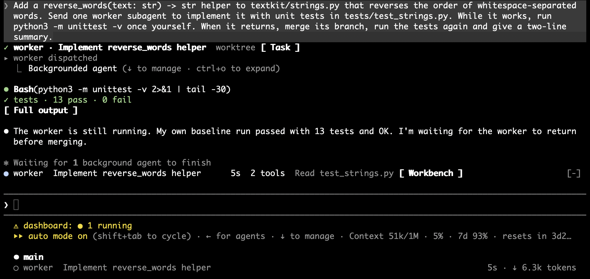
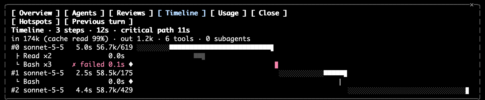

# claude-utopia

> **Under active development.** This repo is updated continuously, and interfaces, names and defaults can change between versions. Star or watch the repo to follow the changes.

[简体中文](README.zh-CN.md)

Four Claude Code plugins built on [mods](https://code.claude.com/docs/en/plugins/mods/overview) (function hooks), plus two agent templates.

| Plugin | What it does |
|---|---|
| `dashboard` | A status band above the prompt for running subagents and mmrun reviews, a line under the prompt with context use and the tightest rate-limit window, and a seven-page workbench (Overview / Agents / Reviews / GPU / Timeline / Usage / Progress) opened with `/dashboard`, `/subagents`, `/mmrun`, `/gpu`, `/timeline`. The Reviews, GPU and Progress tabs show once they have data: an `~/.claude/mmruns` folder, a GPU host, a progress board. The Timeline page draws the main loop's turns as a waterfall of model requests and tool calls, with a hotspot view of the slowest tools and turns. Renders subagent cards, test summaries and blocked-command notices in the transcript. |
| `harness` | Skills: `ai-code-cleanup`, `interrogate`, `shape-task`, `verify-change`, `setup`. Guards: refuse subagents on blocked models, refuse git commands that discard uncommitted work in the shared main worktree, refuse tool calls that would print API-key config files (`~/.claude.json` and its backups, Claude settings, Codex config and auth, grok auth, OpenViking config) or an environment dump (`env`, `printenv`, `export -p`, `set`, …) into the transcript, run `/compact` when the main thread idles until the prompt cache is about to expire. |
| `mm` | Cross-model code review and delegation: `/mm:review` runs codex / grok / agy in parallel as read-only reviewers, `/mm:run` hands a task to another model in its own worktree. Ships the `mmrun` CLI. A guard refuses reading mmrun's `*.raw` event streams (except a lone `tail` of 50 lines or fewer) and moves a foreground `mmrun wait` to the background. |
| `progress` | A per-project progress board. After each turn you typed that changed files or made a commit, the plugin asks Sonnet to record the work as 1–3 nodes (title, summary, status, kind, links to earlier nodes); the main model spends no tokens on it. The board is kept under `~/.claude/progress/` or committed with the project, as you choose once per project. The plugin mirrors the board to an optional Artifact canvas. Works without `dashboard`; with it, the workbench's Progress page lists the board. |
| `agents/` | `worker` and `researcher` subagent templates to copy into `~/.claude/agents/`. |

## Screenshots

The status band above the prompt while a worker subagent runs, with the transcript cards for the dispatched agent and the test summary. Context use and the rate-limit window show only in the line under the prompt:



The workbench's Timeline page: each model request of the last turn, its tool calls and the critical path.



Both screenshots come from a real terminal session with `language` set to English. With `zh-CN`, the same UI is drawn in Chinese; see [简体中文](README.zh-CN.md#截图).

## Requirements

- Claude Code **2.1.287 or later** (mods are on by default from that version). Drawing works in the terminal and the Desktop Code tab; the VS Code panel and `claude -p` run the hooks without drawing.
- `harness`: `python3`.
- `mm`: at least one of the [codex](https://github.com/openai/codex), grok or agy CLIs, plus `bash`, `git`, `jq`, `python3`. The grok and agy read-only fence uses `sandbox-exec`, so it is macOS only; codex uses its own sandbox.
- `dashboard` GPU page: key-based `ssh` to the hosts and `nvidia-smi` (or `tegrastats`) on them.
- Optional: `/mm:run` suggests the `/impeccable` skill for frontend tasks, and `verify-change` suggests the `codegraph_impact` MCP tool. Neither ships here; they are used when installed, and the plugins work without them.

## Install

Let Claude do it: paste this into a Claude Code session.

```text
Fetch and follow the instructions in https://raw.githubusercontent.com/Paradox07127/claude-utopia/main/INSTALL.md
```

Or by hand:

```bash
claude plugin marketplace add Paradox07127/claude-utopia
```

```bash
claude plugin install dashboard@claude-utopia
```

```bash
claude plugin install harness@claude-utopia
```

```bash
claude plugin install mm@claude-utopia
```

```bash
claude plugin install progress@claude-utopia
```

Then start a new Claude Code session. Run the `setup` skill (`/harness:setup`) at any time to review and change the options below.

## Options

Set with `/plugin configure <plugin>@claude-utopia`, or `claude plugin configure <plugin>@claude-utopia --values-stdin` with a JSON object of strings. Changes take effect in the next session.

| Plugin | Key | Default | Meaning |
|---|---|---|---|
| dashboard | `language` | `auto` | UI language: `auto`, `zh-CN` or `en`. `auto` follows the settings `language`, then `LC_ALL` / `LANG`, else English. |
| dashboard | `gpuHosts` | empty | Comma-separated ssh hosts; `ssh <host> …` in Bash opens that host's GPU page. |
| dashboard | `cacheTtlMinutes` | `60` | The fallback prompt cache TTL: after this many idle minutes the band warns that the next message rewrites the prompt cache. Used only until the real TTL is known; a TTL read from the transcript or reported by a model switch overrides it. |
| dashboard | `toastPeerAsks` | `true` | Toast when another Claude Code session asks a permission or its turn fails. Other sessions' toasts show only in the session you typed in last within two minutes, or in every session when you typed in none. |
| dashboard | `toastPeerReplies` | `true` | Toast when another session replies after a turn of two minutes or more. Shown by the same rule. |
| dashboard | `askSound` | `false` | Play a short chime with the toast of another session asking a permission or failing. Needs `toastPeerAsks`. |
| dashboard | `toastRuns` | `true` | Toast when an mmrun model returns, fails or goes stale. |
| harness | `language` | `auto` | Same as above, for the harness toast. |
| harness | `blockedSubagentModels` | empty | Comma-separated; a subagent whose model name contains any entry is refused. Empty allows all. |
| harness | `sharedTreeGitGuard` | `true` | In the main worktree, refuse git commands that discard uncommitted changes or rewrite HEAD: `checkout <path>`, `checkout --force` / `-f`, `restore` (except `--staged` alone), `stash` (except `list`, `show`, `create`), `clean` (except `-n` / `--dry-run`), `switch --discard-changes` / `--force` / `-f`, `reset --hard`, `commit --amend`. Linked worktrees are exempt. |
| harness | `idleCompact` | `true` | When the main thread sits idle until just before the prompt cache expires, run `/compact` automatically: with a 1h cache 10 minutes before, at 100k tokens or more; with a 5m cache 1 minute before, at 200k or more. The TTL is read from the transcript. |
| mm | `reviewModels` | `codex,grok` | Models `/mm:review` uses when no `--models` is given. |

`progress` has no options.

Skills, command docs and every instruction the plugins send to the model are in English; skill descriptions also carry Chinese trigger words so Chinese prompts match them. Claude replies in your language. Only the drawn UI follows `language`.

## Privacy and trust

Mods run in-process with your user permissions, like any plugin hook. `mm` sends the code under review to the external model CLIs you have installed, under their own accounts and terms. Nothing here phones home.

`harness` hides the built-in `general-purpose` agent when `worker.md` or `researcher.md` exists in `~/.claude/agents/` or the project's `.claude/agents/`.

## License

[MIT](LICENSE)
